# Worked-Example Authoring Tool (WEAT)

Welcome to the [**Worked-Example Authoring Tool**](https://adapt2.sis.pitt.edu/pcex-authoring/#/hub)! This documentation provides a step-by-step guide for utilizing every part of the WEAT interface to create interactive programming worked-examples and code-completion problems.

## Table of Contents

- [WEAT Hub](#weat-hub)
  - [1. The Hub Interface](#1-the-hub-interface)
  - [2. Searching and Filtering](#2-searching-and-filtering)
  - [3. The Bundle List](#3-the-bundle-list)
  - [4. Understanding the Bundle Card](#4-understanding-the-bundle-card)
  - [5. Previewing a Bundle](#5-previewing-a-bundle)
  - [6. Cloning a Bundle](#6-cloning-a-bundle)
- [WEAT Sources](#weat-sources)
  - [1. The Sources Interface](#1-the-sources-interface)
  - [2. Toolbar Actions](#2-toolbar-actions)
  - [3. The Source Card (Row)](#3-the-source-card-row)
  - [4. Previewing a Source](#4-previewing-a-source)
  - [5. Cloning a Source](#5-cloning-a-source)
- [Mastering the Source Code Editor](#mastering-the-source-code-editor)
  - [1. Full Editor Overview](#1-full-editor-overview)
  - [2. Navigational Toolbar](#2-navigational-toolbar)
  - [3. Top Section: Metadata & Info](#3-top-section-metadata--info)
  - [4. The Source Code Panel (Left Side)](#4-the-source-code-panel-left-side)
  - [5. Explanations & Configuration (Right Side)](#5-explanations--configuration-right-side)
  - [6. Managing Collaborators](#6-managing-collaborators)
  - [7. Global OpenAI Configuration](#7-global-openai-configuration)
  - [8. Source Translation Feature](#8-source-translation-feature)
- [WEAT Bundles](#weat-bundles)
  - [1. The Bundles Interface](#1-the-bundles-interface)
  - [2. Toolbar Actions](#2-toolbar-actions)
  - [3. The Bundle Card (Row)](#3-the-bundle-card-row)
  - [4. Previewing a Bundle](#4-previewing-a-bundle)
  - [5. Cloning a Bundle](#5-cloning-a-bundle)
- [Editing a Bundle in WEAT](#editing-a-bundle-in-weat)
  - [1. Opening the Editor](#1-opening-the-editor)
  - [2. Basic Information](#2-basic-information)
  - [3. Managing Translations](#3-managing-translations)
  - [4. The Source Items List](#4-the-source-items-list)
  - [5. Editor Footer Options](#5-editor-footer-options)

---

# WEAT Hub

This will guide you through the features of the **Hub** page where you can search, filter, **preview**, and **clone** coding **bundles**.

## 1. The Hub Interface
When you first log in and navigate to the hub, you will see the main layout, consisting of a search box and filters on the left, and a list of bundles on the right.

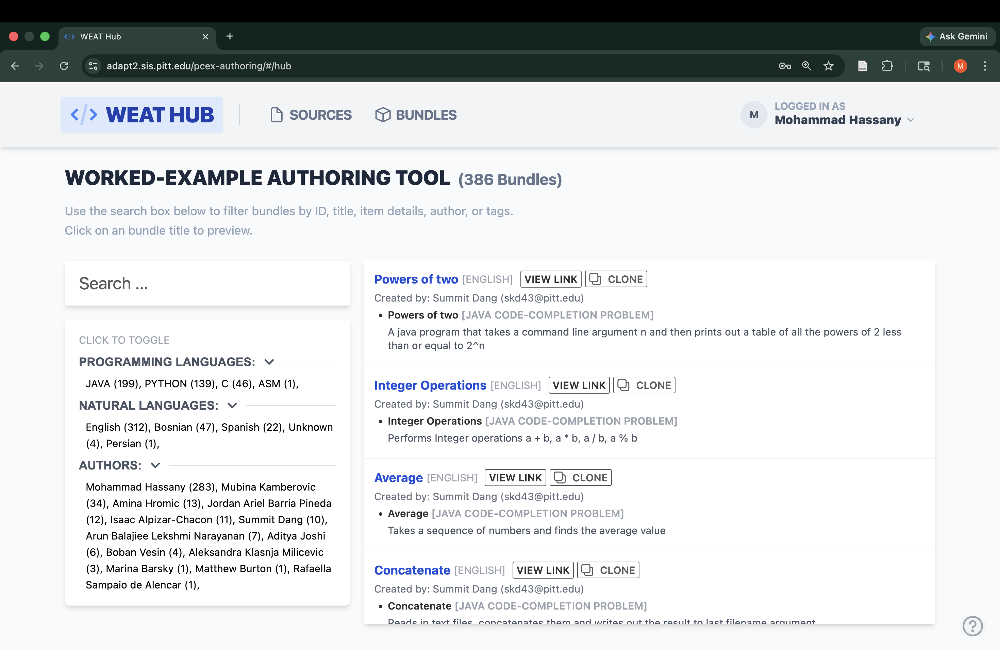

## 2. Searching and Filtering
The sidebar provides powerful tools to refine your view. 

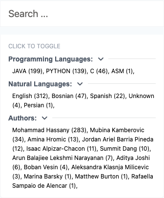

- **Search bar:** Quickly find bundles by typing your query into the text box. The list updates dynamically.
- **Filters:** Click any facet in the Programming Languages, Natural Languages, or Authors sections to instantly apply that filter to the list. 

## 3. The Bundle List
The main result view displays all bundles matching your search and filter criteria.

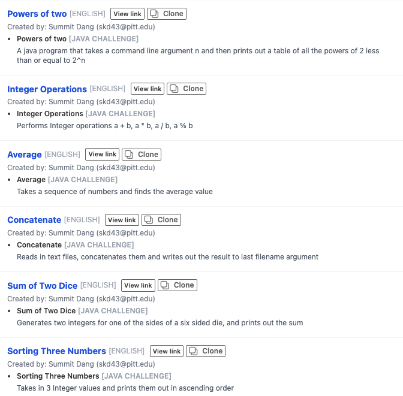

This list provides a centralized place to browse available bundles, offering a quick overview of what worked-examples and code-completion problems are included within each bundle.

## 4. Understanding the Bundle Card
Each row in the list represents a specific bundle. Here's a closer look at what a card contains:

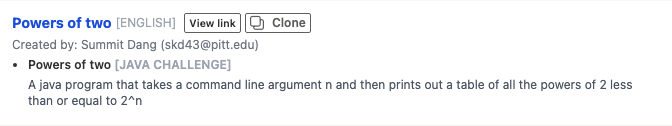

- **Title:** The bold blue text is the name of the bundle. Clicking it opens a live preview.
- **Quick Actions:** Next to the title you can use **VIEW LINK** to access the integration link for that bundle, or click **CLONE** to copy it into your own workspace.
- **Details Section:** This area displays information about translated versions, the author, and lists the specific inner items (and tags) that make up the bundle.

## 5. Previewing a Bundle
By clicking on the title of any bundle, you can examine the bundle exactly as it would appear to the end-user or student. 

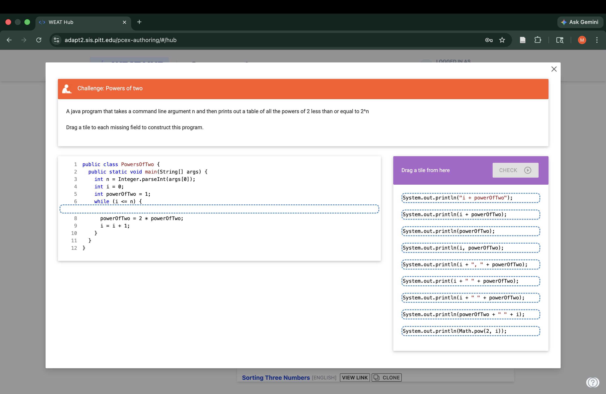

A dialog window overlay will appear, showing the live interactive bundle. You can safely close it using the Escape key or the dialog's close button without losing your place in the hub.

## 6. Cloning a Bundle
If you want to edit a bundle or use it as a template, simply click the "Clone" button on its bundle card. This will open the cloning configuration dialog.

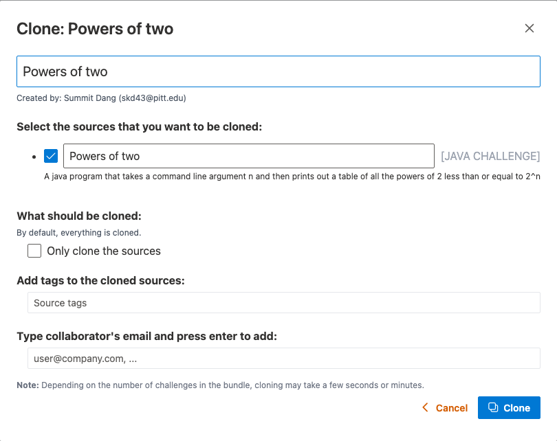

- **Bundle Name:** Assign a new name for your cloned version.
- **Source Selection:** Choose specifically which sources you want to copy over.
- **Options:** You can add specific tags and even assign collaborator emails if you plan to work with a team on this newly cloned material.

With these tools, you are ready to explore, integrate, and reuse content available in the Hub seamlessly. When you are ready to create your own components, proceed to [Managing Sources](#weat-sources). 

---

# WEAT Sources

After discovering content in the [Hub](#weat-hub), you likely want to build your own. The **Worked-Example Authoring Tool** is built around the concept of **Sources** (individual worked-example or code-completion problems) which can be organized into **Bundles** (bundles shown in the Hub). This will help you navigate and manage your items in the "Sources" view.

## 1. The Sources Interface
When you access the Sources page, you are presented with a centralized dashboard. Here, you'll see a complete list of all the source items you have authored or that belong to your team.

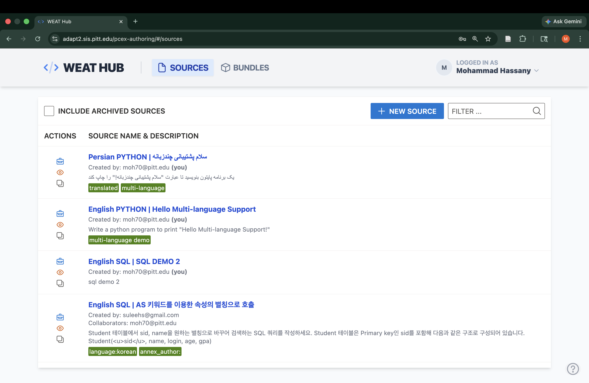

## 2. Toolbar Actions
At the top of the list, a handy toolbar gives you control over what's currently displayed and allows you to add new content.

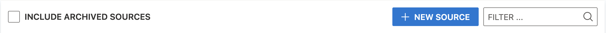

- **Include Archived Sources:** Toggle this checkbox to view or hide old materials that you have retired.
- **New Source:** Click this button to create a brand new source worked-example or code-completion problem from scratch.
- **Filter Box:** Swiftly narrow down your visible sources by typing a keyword inside the filter box.

## 3. The Source Card (Row)
Each row within the table represents a distinct source file.

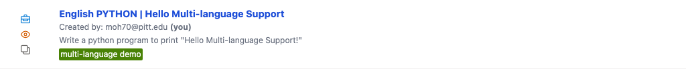

- **Actions (Left column):**
  - **Archive/Unarchive** (Briefcase Icon): Instantly stash the item or retrieve it from archive.
  - **Preview** (Eye Icon): Opens a preview of how the source will function when accessed by learners.
  - **Clone** (Copy Icon): Quickly duplicate the source for editing or creating an alternate version.

- **Information (Right column):** 
  - Click the **Bold Blue Title** to open the Source Editor and make changes to the contents.
  - Also displayed are languages mapped to the item, the user who authored it, any translated counterparts, descriptions, and structural tags assigned to it.

## 4. Previewing a Source
Using the eye icon generates an instant preview window within the app.

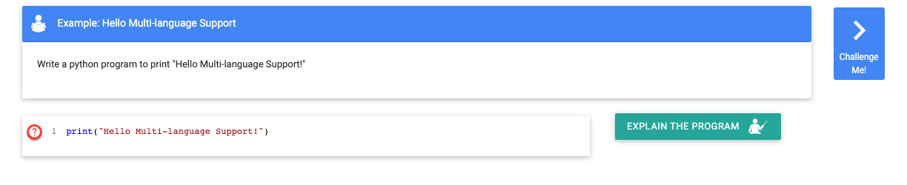

This lets you test interactivity and formatting of standalone sources exactly like a student would—without needing to embed it inside a bundle first!

## 5. Cloning a Source
Often, the easiest way to make a new source is to borrow from an old one! Clicking the "Clone" icon opens a confirmation prompt.

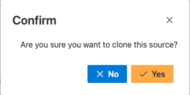

Once you confirm, a fresh duplicate will be instantiated, and you'll be automatically redirected to the editor to rename and alter it.

Now you have everything you need to organize, preview, and build WEAT sources efficiently. Next, learn how to edit individual source contents in [The Source Editor](#mastering-the-source-code-editor). 

---

# Mastering the Source Code Editor

The **Source Code Editor** in WEAT is your primary environment for creating and configuring programming problems, whether they are interactive **code-completion** challenges or step-by-step **worked examples**.

Let's break down the different panels of the Source Editor based on the "Hello Multi-language Support" source.

## 1. Full Editor Overview
The Source Editor is split into several main regions:

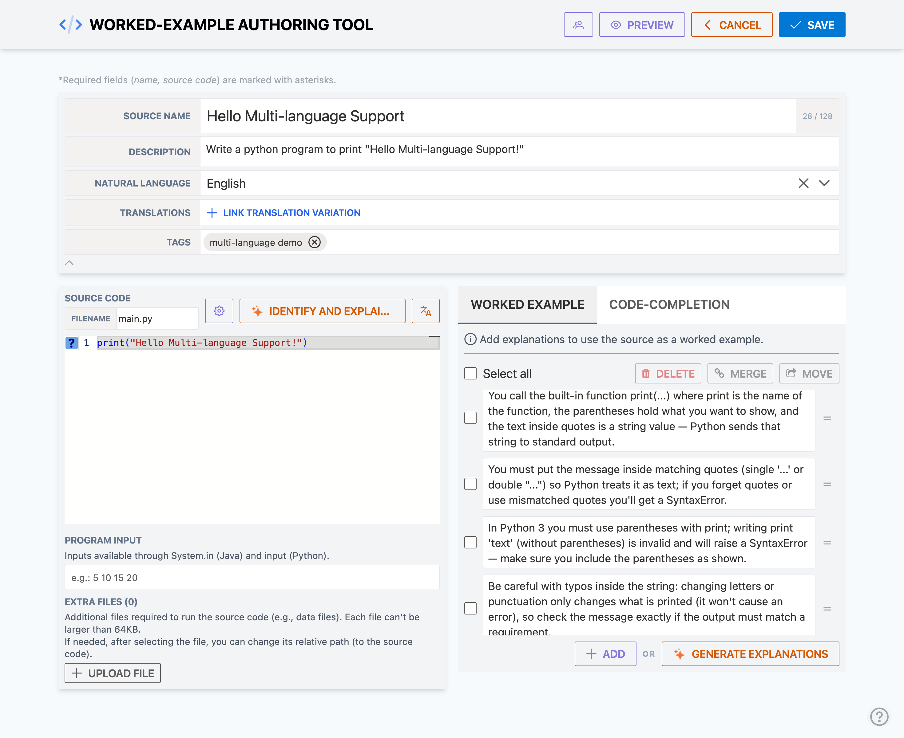

1. **The Navigation Toolbar** at the top.
2. **Metadata & Translations** directly beneath it.
3. **The Code Editor** on the left.
4. **The Worked Example / Code-Completion Panels** on the right.

## 2. Navigational Toolbar

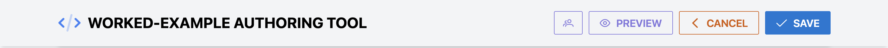

The sticky top bar provides quick actions. Specifically:
- **Translated Version Toggle:** When a translated view is available, use the language button to switch between the translated and original versions.
- **Collaborators:** Add other users to share editing privileges on this specific source file.
- **Preview:** Opens a live pop-up of what the student will actually see when they interact with the source (either as a worked-example or a code-completion problem).

## 3. Top Section: Metadata & Info

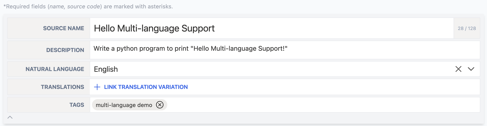

- **Source Name:** A readable name for the source.
- **Description:** A simple explanation of what the source is.
- **Natural Language:** The main natural language of this source.
- **Translations:** Much like bundles, you can link variations of this source. This is incredibly powerful as you can present the same source code with a different translation for comments/strings/descriptions to automatically support internationalization!
- **Tags:** Categorize your source code for easier searching later.

## 4. The Source Code Panel (Left Side)

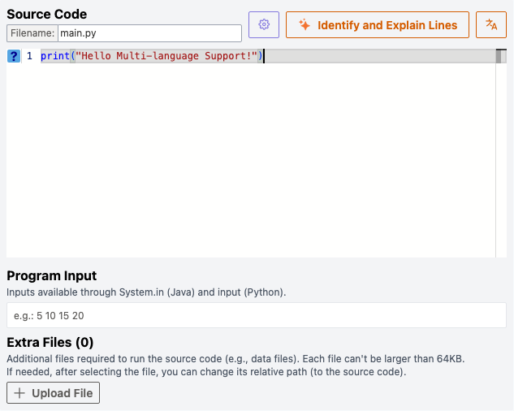

- **Settings:** Here you define the source file name (e.g. `main.py`).
- **Tools:** Use the **Identify and Explain Lines** or **Translate** options to automatically utilize generative AI to write comments and line explanations.
- **Editor:** This is a full-featured code editor. Type your source code straight in!
- **Program Input / Extra Files:** If your program expects `stdin` input to run, paste it in the "Program Input" box. You can also upload test data files!

## 5. Explanations & Configuration (Right Side)
The right-hand panel gives you two tabs allowing your source to function either as a **Worked Example** or a **Code-Completion** activity.

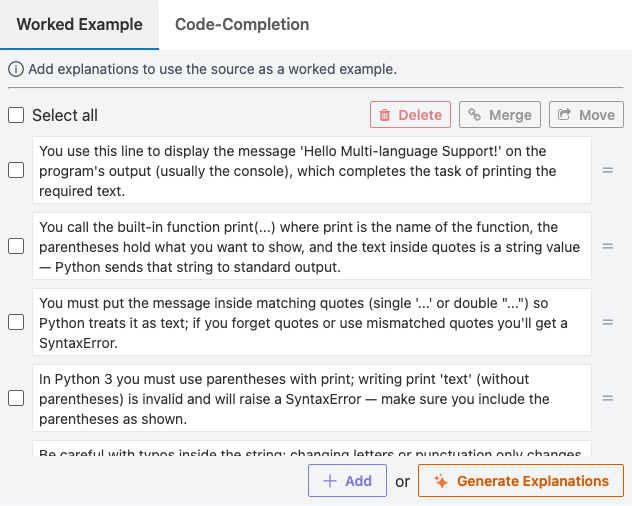

- **Worked Example (Default):** When you click any line on the left side editor, this panel activates. It allows you to write out an _Explanation_ for what that specific line of code does.
- **Code Completion:** 

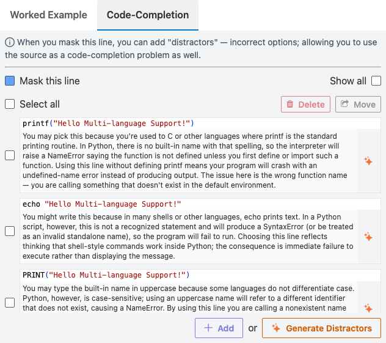

You can toggle the **"Mask this line"** checkbox to hide the selected code line. You can then add **"Distractors"** (incorrect variations of the line) to force the user to correctly choose the right piece of code.

By combining AI generation with the flexible UI, authoring complex, interactive examples has never been easier. Save your code, preview it, and when you are ready to ship it to users, you bundle it inside the Hub! You can learn how to manage the compiled bundles by visiting the [Bundles](#weat-bundles).

## 6. Managing Collaborators

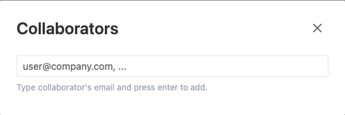

If you want to share authoring rights with a colleague, you can add them to the source's collaborators list. Click the purple users icon in the toolbar, enter their email address, and hit enter to invite them. They will immediately have access to edit the source and its properties.

## 7. Global OpenAI Configuration

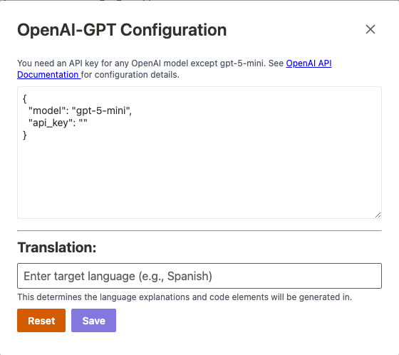

To utilize the AI generation features in WEAT (such as **"Identify and Explain Lines"** or **Translate**), configure the OpenAI-GPT settings here. The current dialog defaults to `gpt-5-mini`, which can be used without supplying your own API key; if you choose another OpenAI model, provide the appropriate API configuration. This dialog also stores the default target language used for generated explanations and translated code elements.

## 8. Source Translation Feature

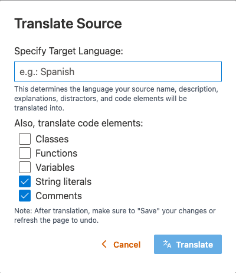

Need to quickly port this source into another language? The **Translate** button triggers a dialog that allows you to specify a new **Target Language**. Additionally, you can configure the granularity of the translation—automatically translating Classes, Functions, Variables, String Literals, or Comments within the source itself!

---

# WEAT Bundles

In **WEAT**, **Bundles** are curated collections of one or multiple **Sources**. As seen in the [Source Editor](#mastering-the-source-code-editor), sources are individual tasks, but bundles are what you ultimately publish to the Hub or integrate into a learning platform. This will help you navigate the "Bundles" section.

## 1. The Bundles Interface
When you visit the Bundles page, you see a full list of all bundles tied to your account or your team. This page helps you organize and manage large groups of programming resources.

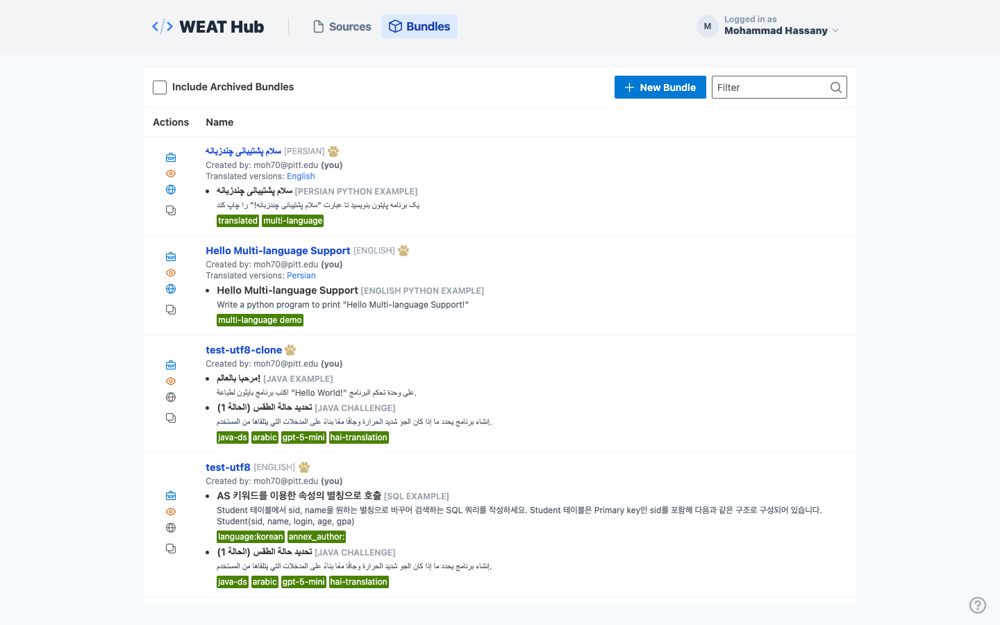

## 2. Toolbar Actions
The toolbar at the top offers quick commands for creating and filtering your bundles.

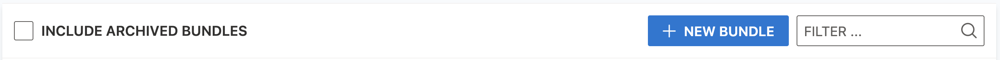

- **Include Archived Bundles:** Similar to sources, this will reveal deprecated or retired bundles.
- **New Bundle:** Click here to create a new bundle from scratch, where you can then add your sources.
- **Filter Box:** Instantly search through your bundles by name or description.

## 3. The Bundle Card (Row)
Each row in the view gives you direct access to the bundle's properties and actions.

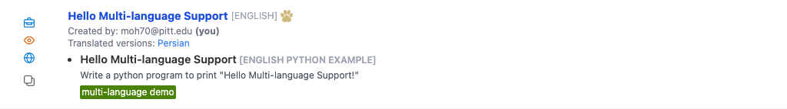

- **Actions (Left column):**
  - **Archive/Unarchive** (Briefcase): Move the bundle out of active rotation.
  - **Preview** (Eye): Launch an interactive preview of the bundle's contents.
  - **Publish/Unpublish** (Globe): Toggle whether this bundle is publicly available in the Hub for others to view or clone.
  - **Clone** (Copy): Duplicate a bundle (and optionally its internal sources).

- **Information (Right column):** 
  - Click the **Bold Blue Title** to open the Bundle Editor, where you can add/remove sources and modify metadata.
  - An icon implies if it's synced with PAWS (it is published to PAWS Catalog and can be used in Course Structure in [Course Authoring Tool](https://adapt2.sis.pitt.edu/next.course-authoring/))
  - You can also see an expanded list of every source item contained inside the bundle along with their specific programming language and description!

## 4. Previewing a Bundle
Curious what the end-user will see? Click the eye icon!

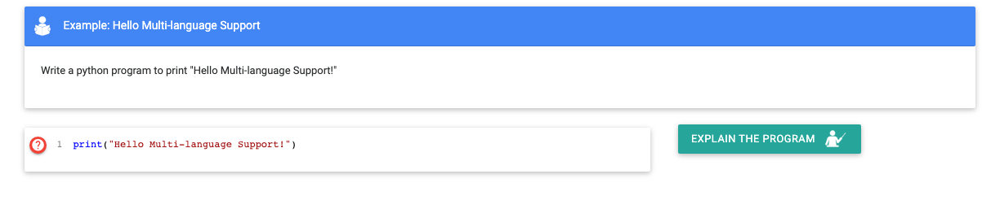

This launches a dialog with the exact interactive interface a learner will use, allowing you to test out sequence and flow right from the dashboard.

## 5. Cloning a Bundle
If you find a good bundle and want an alternate version or copy for a different class, hit the "Clone" icon.

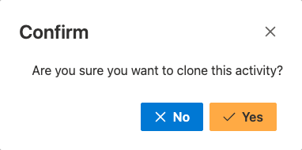

Like sources, a dialog will ask for your confirmation before creating a replica of the bundle mapping for you to edit. Note that you may be prompted if you'd like to deeply **clone the sources** inside or just the **bundle structure** itself depending on the action taken inside the editor.
Like sources, a dialog will ask for your confirmation before creating a replica of the bundle mapping for you to edit.

You are now ready to confidently create, preview, and share Bundles. To understand how to modify the internal mappings and content of a bundle, read the final chapter: [The Bundle Editor](#editing-a-bundle-in-weat). 

---

# Editing a Bundle in WEAT

The **Bundle Editor** gives you total control over the metadata and the actual programming **Sources** linked into your **Bundle**. We will use the "Hello Multi-language Support" bundle as an example.

## 1. Opening the Editor
From the Bundles list view, simply click on the **bold blue title** of the bundle you want to edit.
The row will expand inline right in your table, sliding open the editor form!

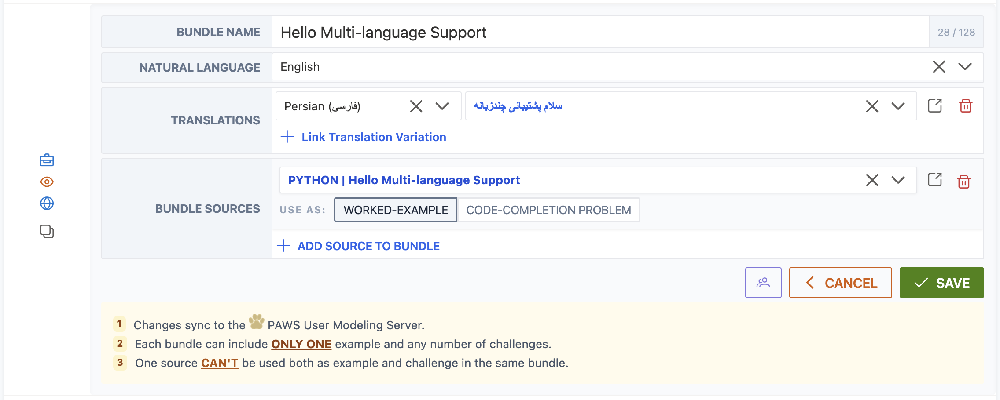

## 2. Basic Information
At the top, you specify the high-level details that identify your bundle across the WEAT platform.

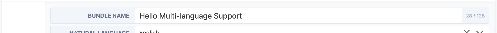

- **Bundle Name:** Give your bundle a concise, identifying title.
- **Natural Language:** Define the primary human language (e.g., English, Spanish) in which the bundle's instructions and text are written.

## 3. Managing Translations
A powerful feature of WEAT is providing support for internationalization through translation links!

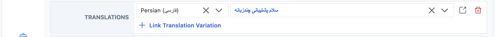

If you have created alternate versions of this bundle translated into other natural languages, you link them here. 
- Use the **Link Translation Variation** button to add a row.
- Select the `Language` and pick the corresponding `Bundle` from the second dropdown. Now, users will be able to easily switch between content variations.

## 4. The Source Items List
The core of your bundle constitutes the individual source files (worked-examples or code-completion problems) mapped inside of it. 

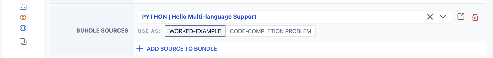

For each item in the list:
- Select the actual programming source from your library using the wide dropdown.
- Assign its role: **Worked-Example** or **Code-Completion Problem**.
*(Reminder: A bundle can currently only hold exactly ONE **Worked-Example**, but any number of **Code-Completion Problems**!)*

## 5. Editor Footer Options
At the bottom of the editor window, you finalize your session.

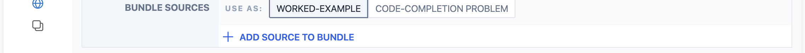

- **Add Source:** Click this to continually append new coding tasks to your bundle list.
- **Collaborators (Users Icon):** Click the purple users icon to summon a popup where you can invite other authors by email to edit this bundle with you.
- **Cancel or Save:** Make sure to hit **Save** once your setup satisfies all validity requirements!

With these controls, you can completely customize how your coding resources are presented, bundled, and translated for your learners! 

**Congratulations!** You have completed the Worked-Example Authoring Tool. You are now equipped to navigate the Hub, organize Sources, author interactive materials with AI, and sequence them into production-ready Bundles. 
